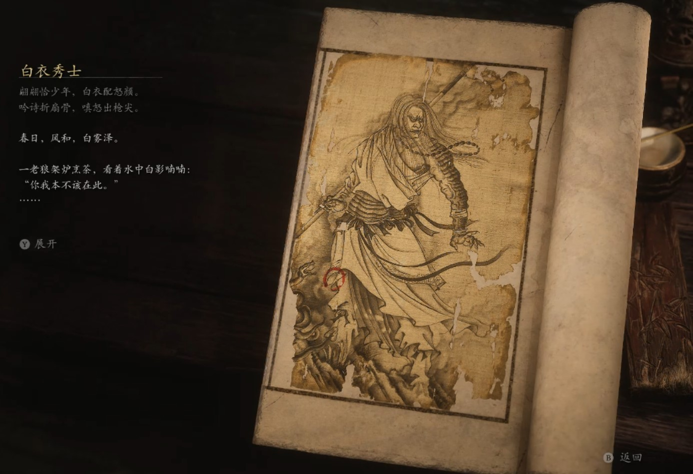

## 类型

人物

## 描述

《黑神话悟空》除了一路上的各种妖怪以外，还有一些中立角色出现，那么这些角色有怎样的背景故事呢，下面请看《黑神话悟空》人物图鉴，希望大家能够喜欢。

翩翩恰少年，白衣配怒颜。

吟诗折扇骨，嗔怒出枪尖。

春日，风和，白雾泽。

一老狼架炉烹茶，看着水中白影喃喃：“你我本不该在此。”

白衣秀士正自舞着—段枪法，闻及此言，倏地将枪掷到炉旁，将身一闪，已握住枪柄，立在老狼身前。

“饮血，还是喝茶？”

“喝茶。坐。”

二人对坐，老狼将一碗茶汤递与秀士。

秀士一饮而尽：“好茶。”

老狼领首，问：“一个烧过的山场，可值许多把戏？”

秀士答：“我奉大哥之命来此，绝无把戏。”

老狼反问：“那我起死回生，难道不是把戏？”

秀士不语，老狼盯着秀士亦不语，他双目虽浑浊，却难掩焦急之情。

秀士思量片时，终是答道：“这个还真不是把戏。”

“若非把戏，何解？”

“你可听过天上那童子，佛祖菩萨有个术法，拼凑外物，念动起死回生真言，遂救得性命。”

老狼苦笑摇头：“大王绝无这等本事。”“他没有，他得来的邪物有。”

老狼心急道：“可我如此苟活，寝食难安。”

“必死则生，幸生则死，一息尚存，也算超然……”

老狼不语，秀士垂眼亦不语，他双目虽异瞳，却难掩怜悯之色。

老狼道：“这茶留于你了。还是喝茶好。”

老狼拂袖起身，喟然而叹：“饮他们的血，我于心何忍呐…。。。”

他蹒跚离去，并非来时之路，只向水泽—侧的岔路拐过。

“叫大王，不用再来看我了。”

    