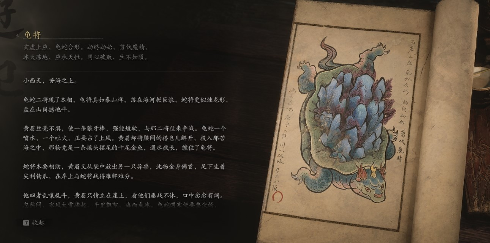

## 类型

人物

## 描述

玄虚上应，龟蛇合形。劫终劫始，剪伐魔精。

冰天冻地，应承天性。同心破败，生不如陨。

小西天，苦海之上。

龟蛇二将现了本相，龟将真如泰山样，落在海河掀巨浪，蛇将更似烛龙形，

盘在山岗撼地平。

黄眉丝毫不惧，使一条狼牙棒，强能短软，与那二将往来争战。龟蛇一个

喷水，一个吐火，正要占了上风。黄眉却将腰间的搭包儿解开，投入那苦

海之中，那物竟是一条摇头摆尾的十尾金鱼，遇水疯长，缠住了龟将。

蛇将本要相助，黄眉又从袋中放出另一只异兽，此物金身佛首，足下生着

尖利钩爪，在岸上与蛇将战得难解难分。

他四者乱嚷乱斗，黄眉只情立在崖上，看他们鏖战不休，口中念念有词。

勿然间，寒风大雪骤起。千甲飘絮，海面成冰。角蛇遇宾便要热伏的，即便成了神仙，也难抵敌天性所限，打斗间逐渐力倦神疲，力不能支，就连眼睛也难以睁开。

又过了不知多少回合，龟将终于抵敌不住，沉入水里。闭上双眼时，他看

到的最后一个情景，是漫天的霜锋寒刃让蛇将无处可躲，在岸边被斩成数段...

    