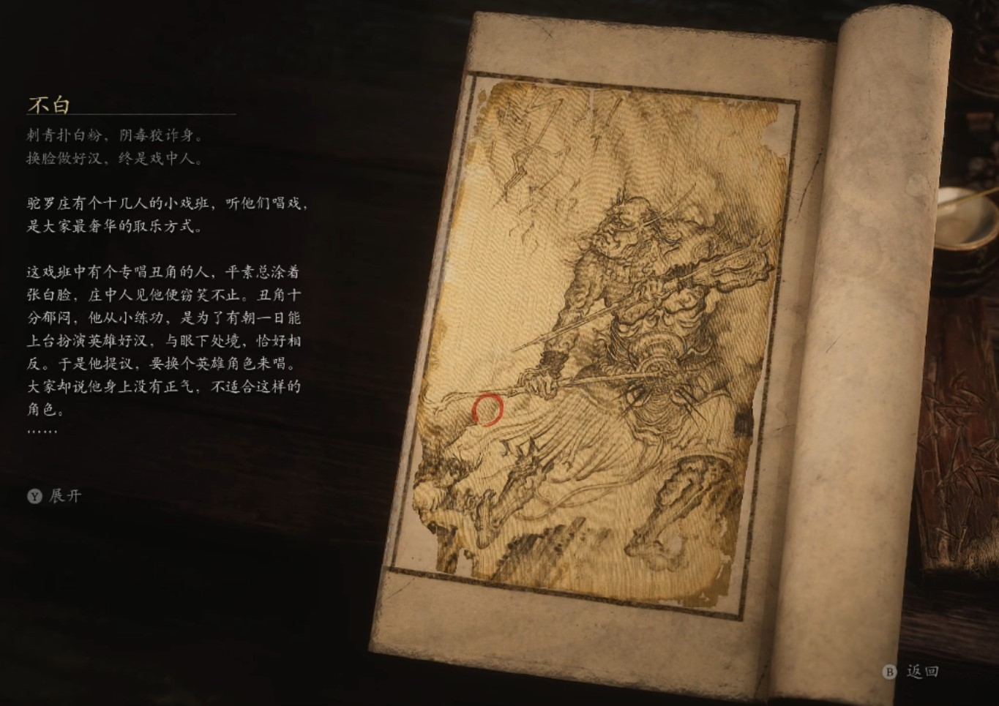

## 类型

头目

## 描述

刺青扑白粉，阴毒狡诈身。

换脸做好汉，终是戏中人。

驼罗庄有个十几人的小戏班，听他们唱戏，是大家最奢华的取乐方式。

这戏班中有个专唱丑角的人，平素总涂着张白脸，庄中人见他便窃笑不止。丑角十分郁闷，他从小练功，是为了有朝一日能上台扮演英雄好汉，与眼下处境，恰好相反。于是他提议，要换个英雄角色来唱。大家却说他身上没有正气，不适合这样的角色。

丑角觉得大家在糊弄自己，便在一次登台时，改了自己的戏份，导致戏没唱完，就被看客砸了戏台。班主一气之下，便将他逐出了戏班。

丑角仔细反思，觉得可能是自己面相生得不好，便守在小巷中，用两柄淬毒的匕首，将素日扮英雄的伶人杀了，又剥下他的面皮，贴在自己脸上，想以此顶替他的生活。可他才刚迈出小巷，周围的人便叫叫喊喊，吓得落荒而逃了。丑角心寒至极，在村中乱砍乱杀，十数个乡勇一起上阵，才把他捉住。他们认为丑角是得了癔症，便将他送到了四千里外，最有名的小雷音寺静修。那庙中的住持听了他的故事，十分畅快地就将他收下，做了弟子。还为他那阴毒又冰寒的心，独创了一门功法。

其后，丑角越变越强，四处剥下人脸，要学画皮的功夫。黄眉也任由他去，还特地命他守在一念壁的窄巷中，等一个能让他功法大成的天命之人。如今，谁都不敢走那条山道，谁都害怕遇见四师兄。

    