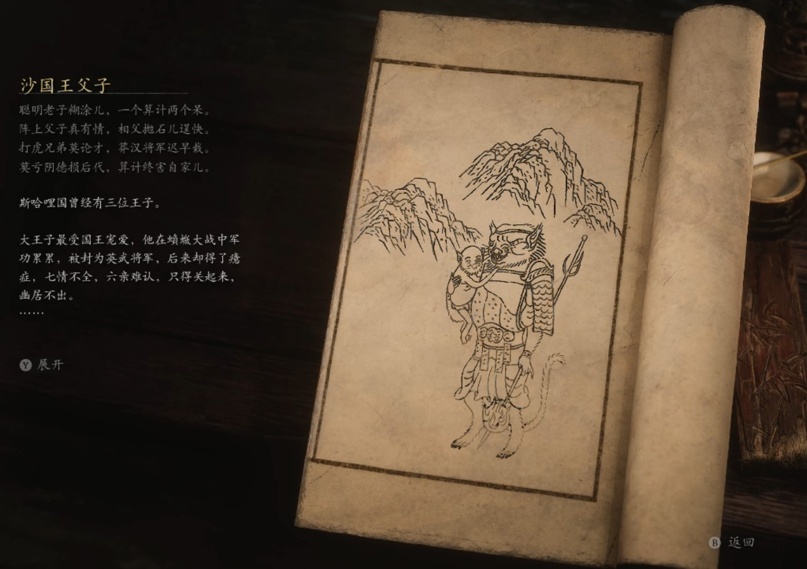

## 类型

头目

## 描述

聪明老子糊涂儿，一个算计两个呆。

阵上父子真有情，相父抛石儿逞快。

打虎兄弟莫论才，莽汉将军迟早栽。

莫亏阴德损后代，算计终害自家儿。

斯哈哩国曾经有三位王子。

大王子最受国王宠爱，他在蝜蝂大战中军功累累，被封为英武将军，后来却得了癔症，七情不全，六亲难认，只得关起来，幽居不出。

沙国王疚心疾首，幸而，他还剩两个儿子。

三王子最受国王信重，饱读诗书，喜爱佛法，文武兼备。可颁布“敬鼠令”后，国王斩杀了一批上书的大臣，三王子诀别而去。沙国王愤气填胸，幸而，他还剩一个儿子。

二王子天生神力，可惜有些憨傻，不似大哥那么能打;没有三弟那么有谋。三个儿子中，国王最不喜他。可陪国王最久的，却偏是他。

黄风大圣终于得了神物，再次归来。沙国王为了复国，带着剩下的国民投入黄风大圣麾下。其时，黄风大圣正缺人手，见二王子有几分蛮勇，便收留了他们。

可黄风大圣手下还有位虎先锋，极好吃鼠。每日都要啖下几只，方可满足。黄风大圣闭关后，他更是肆无忌惮。好在二王子的大锤使得凶悍，倒能稍稍令他忌惮。

二王子为国王做了许多牺牲，可不论局势多惨烈，多艰难，沙国王到哪都要带上大王子，派人寻找三王子，也不知二王子心里到底是种何样的心情。

    