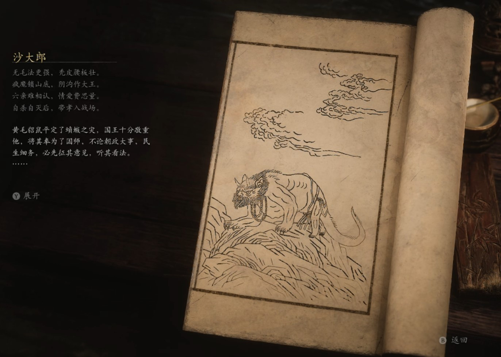

## 类型

头目

## 描述

无毛法更强，秃皮腰板壮。

疯魔锁山底，阴沟作大王。

六亲难相认，情爱费恩量。

自杀自灭后，带孝入战场。

黄毛貂鼠平定了螾缀之灾，国王十分敬重他，将其奉为了国师，不论朝政大事，民生细务，必先征其意见，听其看法。

在国师的提议下，国王颁布了"敬鼠令"，十里八乡的妖怪，纷纷往城内迁徙。

大王子因阵前有功，被封为英武将军，正是春风得意之时。他未曾想，一个妖怪国师却抢了他的风采，内心极是不满。他借着鼠妖作乱为由，四处拉拢朝臣上书，要夺了国师的权位。

朝中闹了数次风波，杀了不少王子党的大臣，连三王子也负气出走，却仍未动摇国王对国师的信任。

这日，正逢国师诞辰，举国上下都在供奉他的雕像，连国王也亲临护国寺，为其添香祝祷。大王子愤懑难忍，当众掀了香案。

天子之威，岂可触犯。国王一怒之下，将大王子下了监牢。国师却不生气，反替英武将军说了许多好话。大王子得知国师求情，更认为他是个城府极深的邪魔，成日在监牢里咒骂不止。国王得知此事，更觉儿子放浪捐介，应严加管教，便下令一日三餐只可送至牢门前，不许任何人探视他。

大王子初时非常耿倔，可日子一久，他便服软起来，不停求饶。只是他心中仍是不服，日夜想着，等他出去，必要杀了那些老鼠，替自己报仇。

这日，饭食迟迟没能送来，他正是惊疑，却听锁钥一响，牢门居然开了。

他等了片时，未见有人进来，就自己走了出去。可他万万没想到，那外头往来穿梭的侍卫，大臣，没有一个人模人样。他们俱是些穿着衣袍的老鼠。

大王子以为国师带着鼠妖篡了皇位，心下惊惶不已，一路横冲直撞，闯入父亲的金殿——

一只矮锉的老鼠，以其父之声，叫唤了他两句。这必是假扮的！大王子一把夺过侍卫的刀，劈向了国王。

殿内乱作一团，只有鼠司空抬来面铜镜让大王子自己观看。镜中哪有什么英武将军，乃是一只肥硕无匹的老鼠。

    