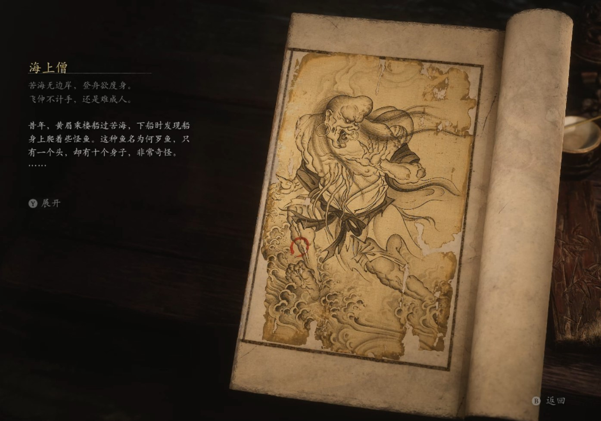

## 类型

头目

## 描述

苦海无边岸，登舟欲度身。

飞伸不计手，还是难成人。

昔年，黄眉乘楼船过苦海，下船时发现船身上爬着些怪鱼。这种鱼名为何罗鱼，只有一个头，却有十个身子，非常奇怪。

那些鱼见到黄眉，便主动扣拜，发出些喊声来，原是想追随黄眉，得脱苦海。

黄眉笑道：“汝等怪形，换做他人，定不会收，但我不同，收些凡夫俗子又有何趣？”

于是，黄眉收了何罗鱼做内门弟子，教他们穿衣识字，甚至因类施教，让他们收敛身形，化出人样，取名唤作海上僧。

未料，这海上僧初学技法，便偷袭黄眉。黄眉也未敷衍，认认真真与他打，只用那狼牙棒一挥，便将其打出殿外去了。

海上僧悟出自已并不能与黄眉近身斗法，便研习出用多余的躯肢抛冰砸雪的歪主意。可黄眉的大殿里并无风雪，他们便又想出创造风雪的法门。每次斗法后，他们都苦思差错，继续精进自己，倒也越来越进益，创出了独树一帜的功法。

咦，虽是跟着同样的师父，但因修习的心境和目的各有不同，徒弟们也总是千差万别哩。

    