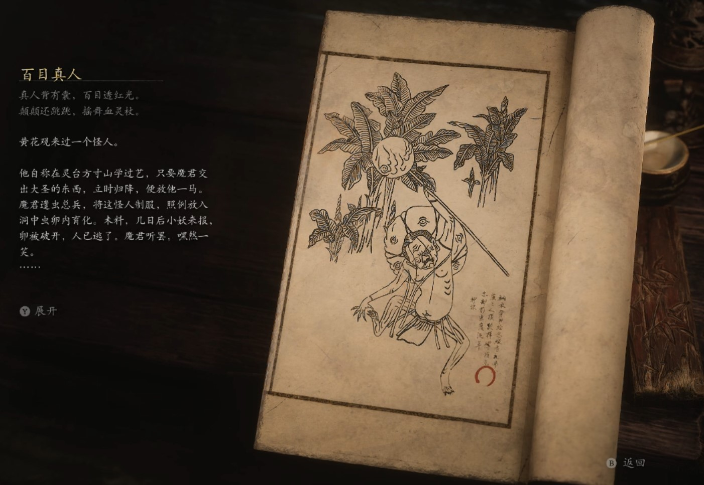

## 类型

头目

## 描述

真人背有囊，百目透红光。

颠颠还跳跳，摇舞血灵杖。

黄花观来过一个怪人。

他自称在灵台方寸山学过艺，只要魔君交出大圣的东西，立时归降，便放他一马。魔君遣虫总兵，将这怪人制服，照例放入洞中虫卵内育化。未料，几日后小妖来报，卵被破开，人已逃了。魔君听罢，嘿然一笑。

自破卵而出，怪人背上生了一颗肉团，团上还有许多眼睛，十分骇人。怪人不以为意，继续云游修炼。

他途经一座荒山，山中盗匪横行，山下村民贫苦不堪。他就地住下，求风求雨，洗青荒山，栽种榆柳，遍植松冉。

过了数年，怪人忽至村中，绰起一根法杖，立在村口。那杖头发出幽幽红光，众生被红光一照，只如着魔般，互相撕咬残杀起来。

霎时间，山下血流成河，宛如地狱现世。

他驼背上的肉团倏忽张开无数眼睛，将周遭的血气精魂缓缓吸入其中。不多时，那肉团便胀大了一圈，直到再也吸不动了，那眼睛才缓缓闭上。

怪人苏醒过来，拔出法杖，又寻下一座荒山去了。

    