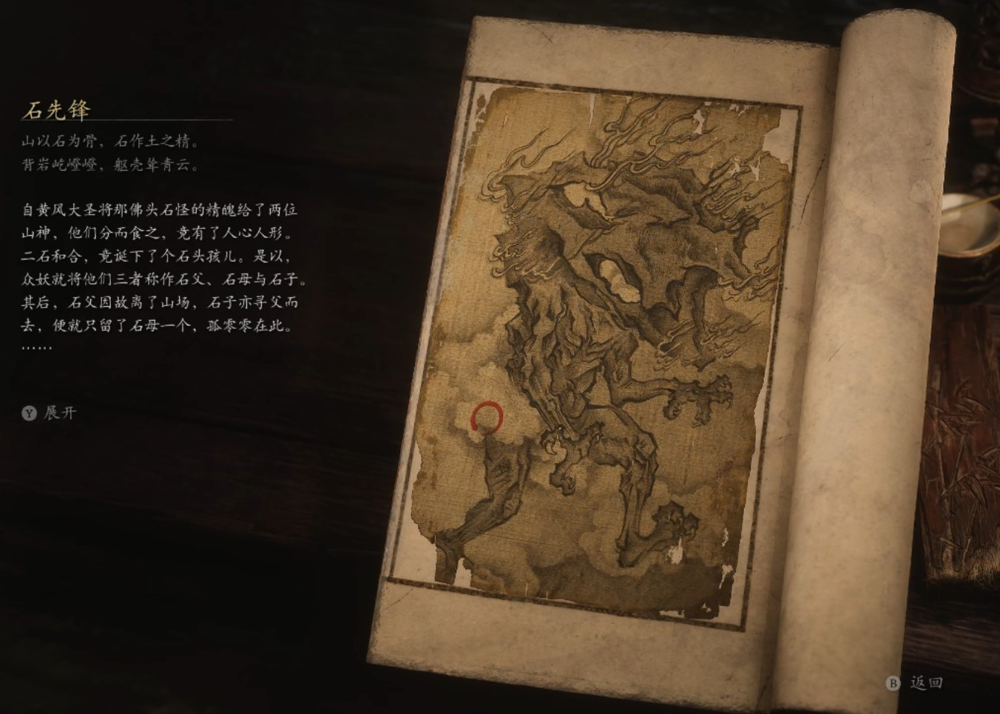

## 类型

妖王

## 描述

山以石为骨，石作土之精。

背岩屹噔噔，躯壳耸青云。

自黄风大圣将那佛头石怪的精魄给了两位山神，他们分而食之，竟有了人心人形。二石和合，竟诞下了个石头孩儿。是以，众妖就将他们三者称作石父、石母与石子。其后，石父因故离了山场，石子亦寻父而去，便就只留了石母一个，孤零零在此。

石母原不喜打打杀杀，黄风大圣授她精魄时，也曾托她好生打造山场，她便以此勤勤恳恳地做了起来。取经人径过黄风岭时，黄风大圣因捉了唐僧，被孙悟空请灵吉捉回了灵山。此去经年，待他重新归来，岭上竟生出了许多石精。其中有只石精，极为健壮强横，打听才知，它乃石母尽全力化生，用以守护洞窟。

一日，黄风大圣亲来寻石母，不想被众石拦在了外头，黄风大圣心下一惊，这般不听指使，留着恐是祸患，便叫唤来新任命的虎先锋，让他铲除此物。

虎先锋先是一口答应，可心中并不愿与他们为敌，当年他们一起合力重塑山场，也算老交情，他知那大石精极受众石精拥护，视其如兄长，便劝道：“兄弟，能有今日，你我吃了不少苦头，能帮我自会帮你。差事我已打点好了，你等只需退入谷内，专司镇守石敢当，也不用做甚恶事。我今日来尚且有话好说，若是明日，就得兵戎相见了。你我虽有些本事，确实非那鼠妖的对手，不如同做个先锋，一切如故，有何不好？“

翌日，黄风大圣封了大石精为石先锋，命其率领群石退守河谷。自那以后，石精们老实本分地守着那封印的邪物，再也不过问山中之事了。

    