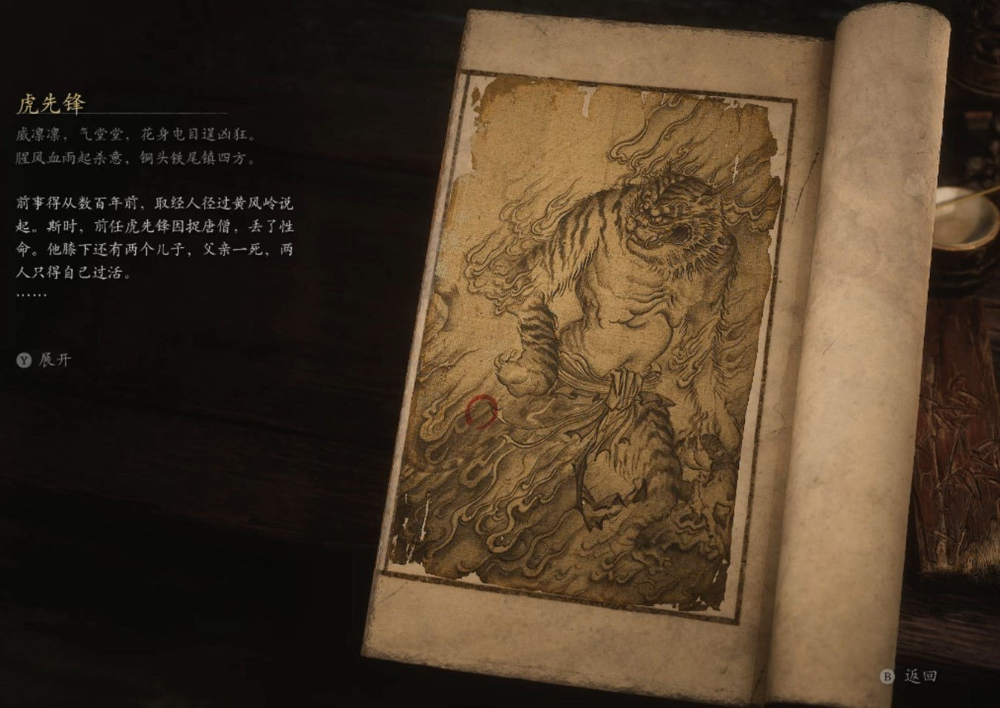

## 类型

妖王

## 描述

威凛凛，气堂堂，花身电目逞凶狂。

腥风血雨起杀意，铜头铁尾镇四方。

前事得从数百年前，取经人经过黄风岭说起。斯时，前任虎先锋因捉唐僧，丢了性命。他膝下还有两个儿子，父亲一死，两人只得自已过活。

山场尽毁，虎兄弟二人领着残存的小妖艰难求存，幸而父亲教过他们些真本事。随着风沙停息，石精逐渐将山场恢复昔日样貌。虎兄仿照父亲昔日所做，管束着山中妖怪，让他们各安其职，不随意祸害生灵。后来，有凡人见此地山清水秀，便在山中建起了村庄。虎兄又依照“啖尽迷路奸邪，护送过往好人”的规则，为自己博了个“虎神”的名号。

村人为虎兄虎弟建了座卧虎寺，常常供奉，日子越发好了。唯有虎弟心下不服，总觉每每提及山中之虎，兄长占尽威风，只因比自己早生几年。

又过了百年，黄风大圣带着一众鼠妖重回黄风岭。虎弟说，正因黄风大圣当初坐视不理，才致父亲身亡，他嚷着要杀黄风大圣替父报仇，怂恿虎兄赶走鼠妖，虎兄觉得有理，应承下来。谁知这战中，黄风大圣祭出了一个仿佛菩萨头颅的法器，呼风如刀，一个照面便重伤了虎弟。虎兄为保弟弟一命，旋即扔掉兵器，跪下称臣，黄风大圣也不计较，将他命为先锋，让虎弟此生不再踏入黄风岭。虎弟救还醒转，得知兄长做了先锋，又不肯依。二虎大吵一番，虎弟负气出走，再也不肯与兄长有任何往来。

在虎先锋看来，那黄毛貂鼠害得他家破人散，两次毁了他的家，着实可恨。但他也不糊涂，深知只要天上有人为那貂鼠撑腰，除了每天多吃几只老鼠泄愤，又能做些什么哩？

    