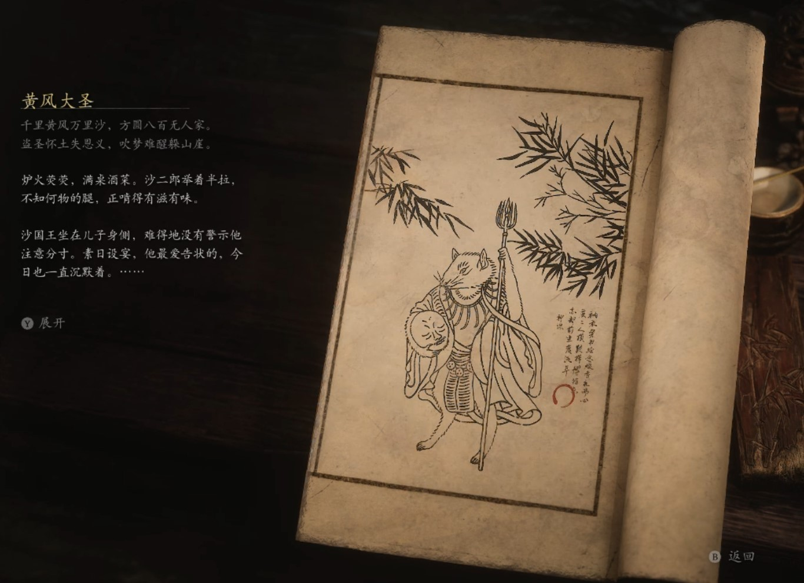

## 类型

妖王

## 描述

千里黄风万里沙，方圆八百无人家。

盗圣怀土失恩义，吹梦难醒躲山崖。

炉火荧荧，满桌酒菜。沙二郎举着半拉，不知何物的腿，正啃得有滋有味。

沙国王坐在儿子身侧，难得地没有警示他注意分寸。素日设宴，他最爱告状的，今日也一直沉默着。

虎先锋也十分文雅，他看着对面的傻子吃得喷香，肚里饥渴难耐，还是忍住了。

黄风大圣坐在太师椅内，一只手摸着桌上闭目的佛头，一边喃喃道：“师父呀师父，你常说让我永远陪在你身边，如今无论到哪里，我都带着你了。”听到这话，虎先锋和沙国王垂下头，甚至不敢抬头多看两眼灵吉的头颅。大王面前禁提灵吉，一直是不成文的规矩。

又过了不知多久，沙二郎一声爹，在场所有人都惊了一跳。沙国王压低声怒斥道：“闭嘴。”其后连滚带爬跪下讨饶道：“大王，我这孩儿有些疯病，但他很是骁勇，能替大王办不少事，大王……”

“起来吧，都是小事。”言罢，黄风大圣把手搭在灵吉的头顶，站起身来，道：“我拿了师父最宝贝的东西，定能炼化那邪物。我准备从今日起闭关修行。天上那些老东西虽已安排好了，还是多留一手为妙。”

“大王若想闭关，我和我的子民愿搬来洞外守护。”沙国王谄媚道。

“不用。我要在谷中修行，你那鼠村就让给我住罢。”

“若是能守在大王身侧，自是我等的荣耀。”沙国王笑着。

“留在我身侧？”黄风大圣看着师父的头，守在身侧的，才是最可怕的。

他摇头对沙国王道：“你们搬去岭上住罢。那处不是有些凡人的庄子吗？占去就是了。我要开黄风大阵，谁都不要来打扰我。”

“大王，若是……有急事要通报您该如何是好？”沙国王急急追问。

黄风大圣抱起桌上的头颅，来回踱了几步，指着虎先锋道：“叫你那石头兄弟。修几条沙道，每个沙道由大门锁住，需要秘符才能开启。你们两个先锋，各拿一个秘符，日常事务就归你们暂管。出了天大的事，再来报我。”

虎先锋得了这般大任，赶紧下拜谢恩。那沙国王急切道：“大王，我们与那大猫向来不睦，若是由他们领了秘符……”

“你那两个儿子，可能担大任？”黄风大圣看了一眼无事可做，正在啃瓜锤的沙二郎，沙国王露出一脸挫败。

黄风大圣又道：“你也不用太担心，鼠禁卫会监管他们，你只做好份内的事就行。”

“大王，大王！秘符一事可再商量…。。”

但是任凭他如何呼唤，黄风大圣只是叫送客，其后抱着佛头，又陷入了沉思。

    