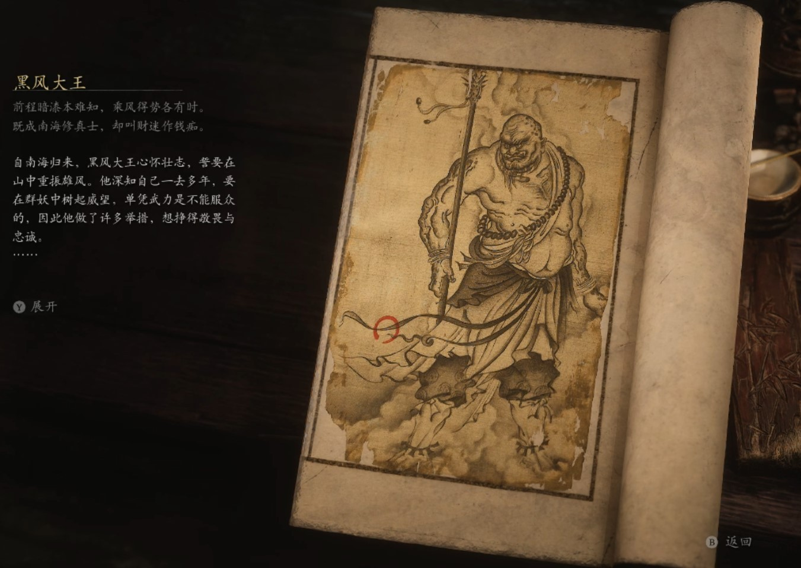

## 类型

妖王

## 描述

前程暗漆本难知，乘风得势各有时。

既成南海修真士，却叫财迷作钱痴。

自南海归来，黑风大王心怀壮志，誓要在山中重振雄风。他深知自己一去多年，要在群妖中树起威望，单凭武力是不能服众的，因此他做了许多举措，想挣得敬畏与忠诚。

在南海时，他学过起死回生真言，便以自愿赴死的狼妖为牺牲，救活了苍狼精老凌虚子。不曾想那老狼却不识好歹，还魂后留下只言片语竟不再见他了。

黑风大王怕群狼无首，乱了阵脚，只好另选狼妖继任妖王。他见狮驼国来的苍狼精，年富力强，是个尚佳之选，便亲自赐了名、扶他上位。不曾想群狼却在禅院引发动乱，险些酿下自相残杀的大祸。

见众妖难以与自己相知，苦闷之下，他又施法想要还魂昔日一同论禅的老和尚。不曾想那老和尚的魂魄未在拼凑的尸身上复生，反与他旧日理藏的金银铜钱化生了个发昏的精怪，天天搅扰山场，没个消停。

幸而，白衣秀士深得黑熊精重用，认为是个一等一的贤能之辈，赤胆忠义，为他省下许多烦恼。

咦，自作高明，反而一事无成，真可谓下士有志，不如碌碌庸人哩。

    