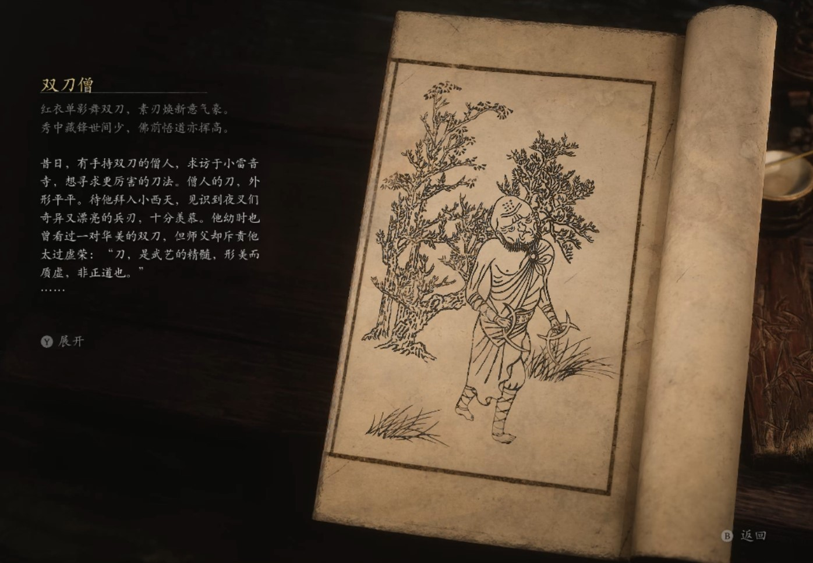

## 类型

小妖

## 描述

红衣单影舞双刀，素刃焕新意气豪。

秀中藏锋世间少，佛前悟道亦挥高。

昔日，有手持双刀的僧人，求访于小雷音寺，想寻求更厉害的刀法。

僧人的刀，外形平平。待他拜入小西天，见识到夜叉们奇异又漂亮的兵刃，十分羡慕。他幼时也曾看过一对华美的双刀，但师父却斥责他太过虚荣：“刀，是武艺的精髓，形美而质虚，非正道也。”

僧人谨记此话，但如今见旁人并未遵循此道，内心便有了动摇。他寻到夜叉处，询问他们关于师父所说的美丑之理。夜叉们答道：“刀越好看，我越想勤加练习，想让自己的实力与之相匹配，何来妨碍之说？”

僧人犹豫不决，又问寺中使戒铲大刀的不净师兄，师兄道：“刀法既已练成，昔年之事，你又何必挂怀？”

僧人闻言立刻弃了旧刀，依着夜叉们那些华丽的刀形，为自己铸了两柄新刀，圆满了幼时的愿望。自从用了这两柄新刀，他的刀法变得更凌厉更有气势了，但也露出了更多破绽。

咦，世事总是利害相生，好坏参半，无所谓哪个更好，终究还是要看是否足够喜欢。

    