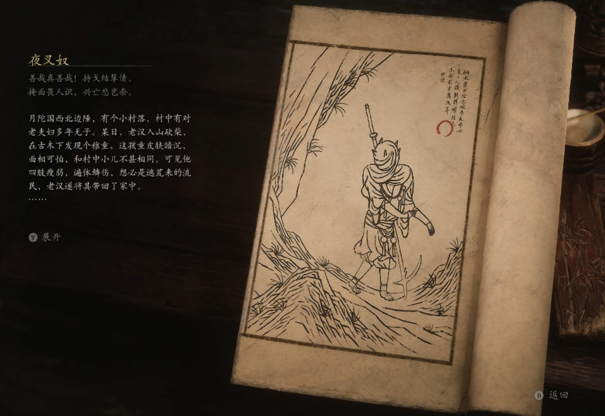

## 类型

小妖

## 描述

善哉真善哉！持戈结孽债。

掩面畏人识，兴亡悲岂奈。

月陀国西北边陲，有个小村落，村中有对老夫妇多年无子。某日，老汉入山砍柴，在古木下发现个稚童。这孩童皮肤暗沉，面相可怕，和村中小儿不甚相同。可见他四肢瘦弱，遍体鳞伤，想必是逃荒来的流民，老汉遂将其带回了家中。老妇亦觉此子非比寻常，本要将其送走，但与他洗净更衣，煮饭喂养后，不免生出些怜爱来。二人一番商量，决意收留他。

初时，夫妻二人对孩子极好，可不及半载，因他长相迥异，村人私下议论不止，都唤他为“丑奴”。老夫妇亦觉丢脸，对丑奴也不如先前和善，甚至也跟着叫他丑奴。未过两年，丑奴的肤色变成了暗青色，老夫妇便让他穿着厚实的衣裳，掩其全身，酷暑也不许他脱下。

又过了三年，丑奴身形逐渐魁梧，头上生出许多尖角。老汉愈发惶恐，将其禁闭于柴房中，每遇不快，便入内鞭挞，有时还以柴刀削其尖角，令他满身满脸，鲜血淋漓。老妇见此情景，心中厌恶，亦以麻袋套住其头。丑奴在柴房中，又如此挨过了五年。

一日，有群流浪的夜叉径过此地，闻柴房内有夜叉语发出咒骂声，闯入一看看，发现是自己饱受折磨的同胞。他们给了丑奴一把长戟，丑奴愤然杀入屋内，将老夫妇对他所做种种，一一奉还。

多年后，丑奴心中的不平依然难以静息，只有戏虐猎物，才能让他感到快乐。

    