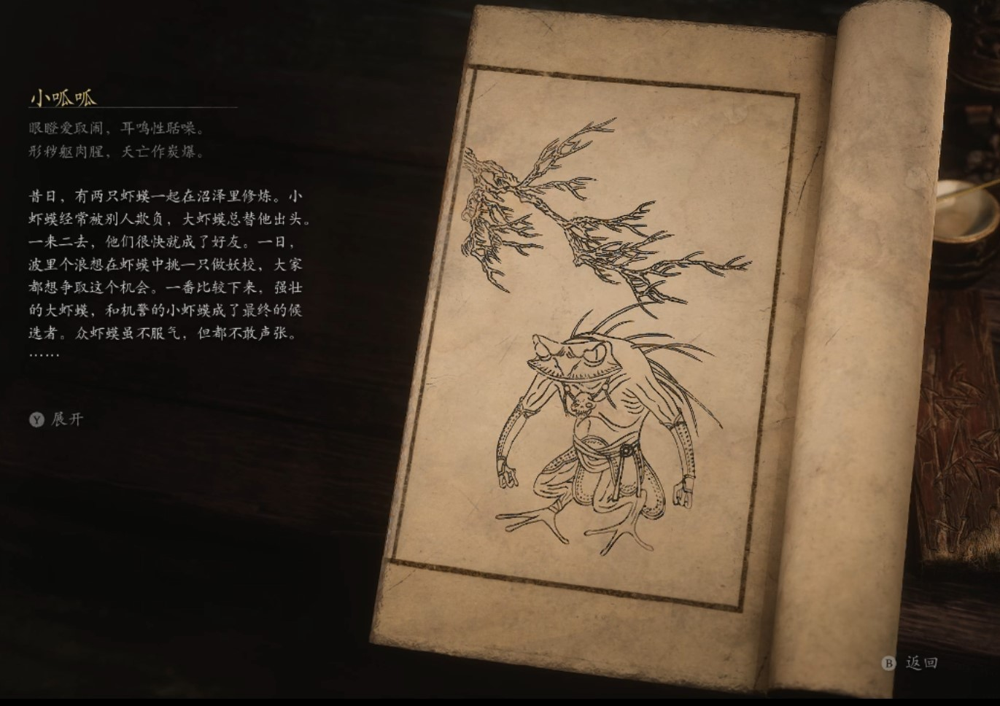

## 类型

小妖

## 描述

眼瞪爱取闹，耳鸣性聒噪。

形秽躯肉腥，天亡作炭爆。

昔日，有两只虾蟆一起在沼泽里修炼。小虾蟆经常被别人欺负，大虾蟆总替他出头。一来二去，他们很快就成了好友。一日，波里个浪想在虾蟆中挑一只做妖校，大家都想争取这个机会。一番比较下来，强壮的大虾蟆，和机警的小虾蟆成了最终的候选者。众虾蟆虽不服气，但都不敢声张。

这日，大、小虾蟆负责执守波里个浪的洞府，有个琥珀杯无故碎了，查不出何人所为。众虾蟆不依不饶，聒聒噪噪，非要他俩负责。大虾蟆争吵不过，便与他们大打出手，众虾蟆便说他是恼羞成怒，肯定是他打碎的。小虾蟆站在一旁，绒口不言，大虾蟆就责怪他不为自已辩解，进而怀疑起小虾蟆。

小虾蟆犹豫片刻，承认琥珀杯正是自已打碎的。众虾蟆却不买账，说他们一个蓄意胡为，一个玩忽职守，都要偿命。小虾蟆越听越急，忍不住也和他们吵起来。他们吵得越来越大声，肚子鼓得越来越高，忽然，有几个的肚皮被撑破，炸裂开来。血肉溅了众妖满头满脸，最后没一个干净的。

    