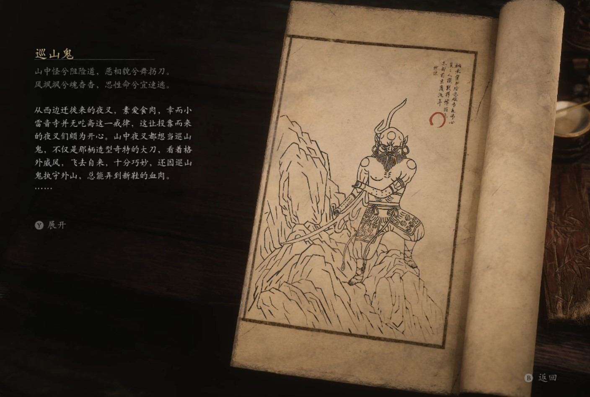

## 类型

小妖

## 描述

山中怪兮阻险道，恶相貌兮舞拐刀。

风飒飒兮魂杳杳，思性命兮宜速逃。

从西边迁徙来的夜叉，素爱食肉，幸而小雷音寺并无吃斋这一戒律，这让投靠而来的夜叉们颇为开心。

山中夜叉都想当巡山鬼，不仅是那柄造型奇特的大刀，看着格外威风，飞去自来，十分巧妙，还因巡山鬼执守外山，总能弄到新鞋的血肉。

这日，众夜叉正聚在一起饮血吃肉，开怀享乐，由于太过嬉闹，庙里人尽皆知。监院僧很不满意，他们秉承苦修，只吃素食，便抬着一口大锅，寻至夜叉跟前。众夜叉往锅内一瞧，俱些萝卜青菜，顿觉扫兴。

夜叉呵斥道：“难道吃这些就能助你对佛法有更精妙的理解？真是肤浅。”另一个又道：“师父说过，要修极乐，就不要辖制欲望。”听到这话，监院僧便道：“我的欲望就是劝善，不劝你们，我也无法修极乐。”于是双方争得面红耳赤，也没分出个对错。

咦，吃自己喜欢的东西，说自己想说的话，原本都没有错。但自己的快乐应该不骚扰他人，而人也不应以打扰旁人来取乐，只能说他们双方都不对罢。

    