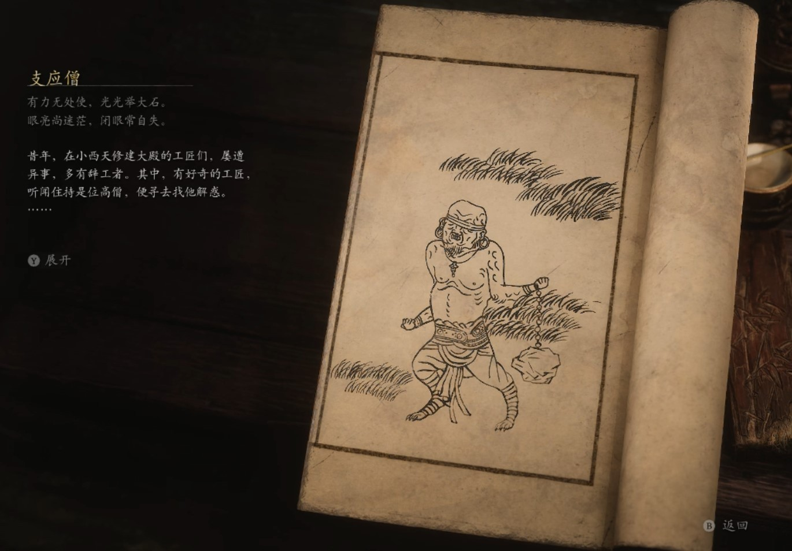

## 类型

小妖

## 描述

有力无处使，光光举大石。

眼亮尚迷茫，闭眼常自失。

昔年，在小西天修建大殿的工匠们，屡遭异事，多有辞工者。其中，有好奇的工匠，听闻住持是位高僧，便寻去找他解惑。

住持毫不避讳，引其至浮屠塔中，让他见了掌灯狱使。工匠们见后，心中骇然，虽幼时也曾听过妖怪传说，但从未亲眼见过。斯时，塔中妙音响起，掌灯狱使瞬发光亮，工匠们双目应光而盲，众人叫苦不迭。

住持笑道：“要见真相，必有舍取。汝等不若留在这庙里，随我修习极乐大道，或有缘超升凡界，早登佛国。”

工匠们情知自己瞎了双眼，难找活计，索性弃了尘世，入寺修行。他们向住持询问，应该如何修行，住持答道：“你们所长何事，即修何法。”

工匠们背力过人，遂决定以武悟道，因盲眼，便跟着监院僧修炼。他们将大石拴上铁链，扣在腕上，日日挥举，恰好将那修建寺庙的石料也备齐了。住持很高兴，让他们做了支应僧，还省下一笔工钱哩。

    