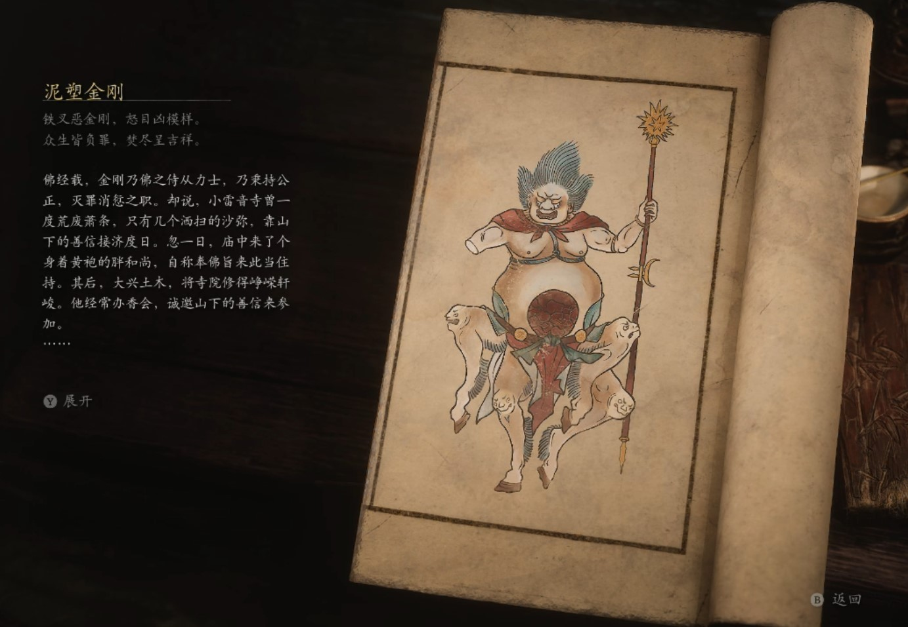

## 类型

小妖

## 描述

铁叉恶金刚，怒目凶模样。

众生皆负罪，焚尽呈吉祥。

佛经载，金刚乃佛之侍从力士，乃秉持公正，灭罪消愆之职。

却说，小雷音寺曾一度荒废萧条，只有几个洒扫的沙弥，靠山下的善信接济度日。忽一日，庙中来了个身着黄袍的胖和尚，自称奉佛旨来此当住持。其后，大兴土木，将寺院修得峥嵘轩峻。他经常办香会，诚邀山下的善信来参加。

一次，有二位香客，在大殿首次相逢。他二人初一见面，便心念电转，对彼此陡生警觉。斯时，院主令人抬入一尊金刚塑像。此像四足而立，手持钢叉，怒目而视，但胸前却有一洞，形态十分怪异。

院主介绍道，这是他新塑之物，以附了通灵之法，极是应验，能断是非。二位香客其中之一，急忙走到金刚前，道：“愿金刚灭尽世间捣虚的骗子，还某一个公道。”原来此人是个素爱贪便宜的老实人，常常受骗，又不敢讨还，所以有此一愿。

另一个则赶紧道：“愿金刚灭尽那些贪了便宜又牢骚满腹的人，还某一个清净。”原来此人素爱以次克好，是个黑心的商贾，经常被人追骂，到处躲藏，所以有此一愿。

二人听了彼此的愿望，在塑像前大吵起来。那金刚兀自眼珠一转，一叉挥下，将两人一并刺死，又从四足上喷出火来，将他们的尸首烧了个干净。

此事传开，乡里皆惊，有人骂那住持以妖法惑众，有人说他佛法高深，神通广大，但无人敢不敬畏他。

    