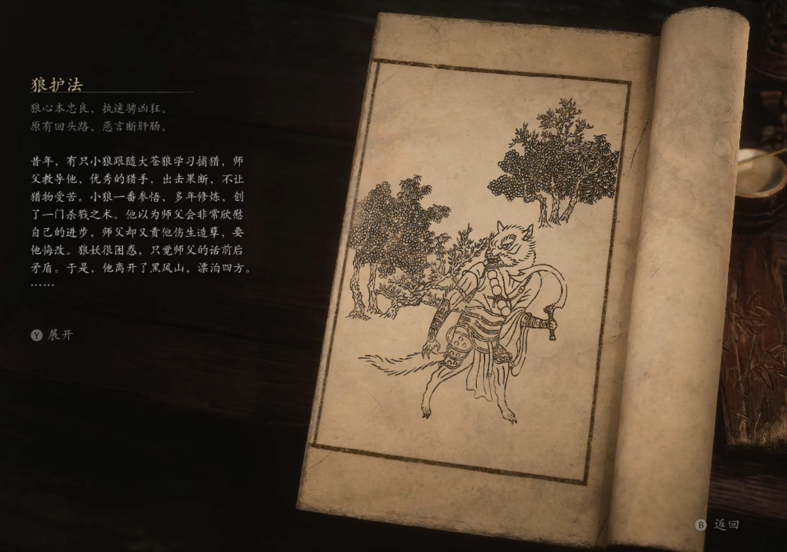

## 类型

小妖

## 描述

狼心本忠良，执迷骋凶狂。

原有回头路，恶言断肝肠。

昔年，有只小狼跟随大苍狼学习捕猎，师父教导他，优秀的猎手，出击果断，不让猎物受苦。小狼一番参悟，多年修炼，创了一门杀戮之术。他以为师父会非常欣慰自己的进步，师父却又责他伤生造孽，要他悔改。狼妖很困惑，只觉师父的话前后矛盾。于是，他离开了黑风山，漂泊四方。

途中，他听世人的传言，都说狼虽坚韧团结，却鄙薄凶残，忘恩负义。狼妖愈发困惑，似乎多年修炼，都与世界相悖。

一日，他途经小西天，听闻此地有种极乐法门，可解脱心绪之苦，他便主动求见了院主。

院主是位爱化形的黄袍胖和尚，他听狼妖诉完苦恼，开解道：“狼，生而食肉，杀生屠戮，此乃天性;凡人不同，他们生而食谷，播种采收，天性弱小。故而他们想用编造的准则来约束狼，希望免遭毒手。依我看，各从其类，各行其欲方好，何必拘泥人言？”

听罢此话，狼妖豁然开朗，决意拜入小雷音寺，追求极乐大道。胖和尚笑道：“我这寺中，唯从已心。贪生怕死，莫入此门。”狼妖欣然接受，成了院主最忠诚的护法。他们手持镰刀，没有任何礼义廉耻的准则，无论他说什么，切莫当真。

    