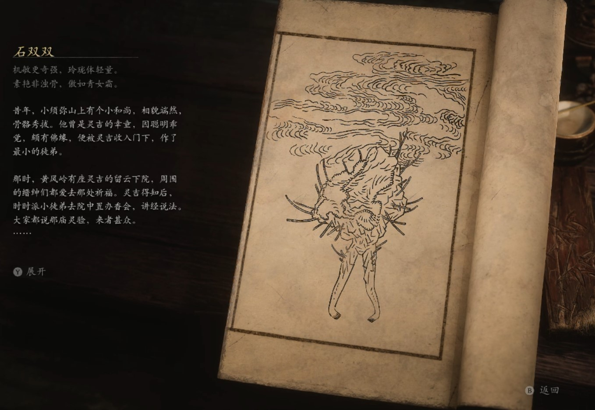

## 类型

小妖

## 描述

机敏更奇强，玲珑体轻量。

素艳非浊骨，傲如青女霜。

昔年，小须弥山上有个小和尚，相貌端然，骨骼秀拔。他曾是灵吉的幸童，因聪明乖觉，颇有佛缘，便被灵吉收入门下，作了最小的徒弟。

那时，黄风岭有座灵吉的留云下院，周围的缙绅们都爱去那处祈福。灵吉得知后，时时派小徒弟去院中置办香会，讲经说法。大家都说那庙灵验，来者甚众。

却说，斯哈哩国宰相之女，生得脸似堆花，体如琢玉。偏她生性孤高，不爱刺绣针织，只喜穿着劲装打猎习武，特别是她那身拳腿功夫，等闲武人难以匹敌。

这日，她听闻山中的庙场香会，十分好奇，急着要去与众人辩论佛法，正巧遇上灵吉的小徒弟。二人畅谈一番，很是投机，此后，凡有香会，她必定到场。

不久，灵吉察觉出徒弟的异样，他不动声色，带着小徒弟往灵山参加龙华会去也。小和尚只觉在灵山上呆了几天，下界却已过了数十年。待他回到山中，寻着线索找去宰相家，只见昔日的貌美女郎，已成了现任宰相府的老太太，家族枝繁叶茂，门庭煊赫，令小和尚五味杂陈。

其后，他在山中依照她年轻时的模样塑了许多石像，将它们点化成活物，代替她陪在身旁。只是这些石女始终冷冷清清，久而久之他才觉得自己可笑至极，又将她们的头脸悉数毁去了。

    