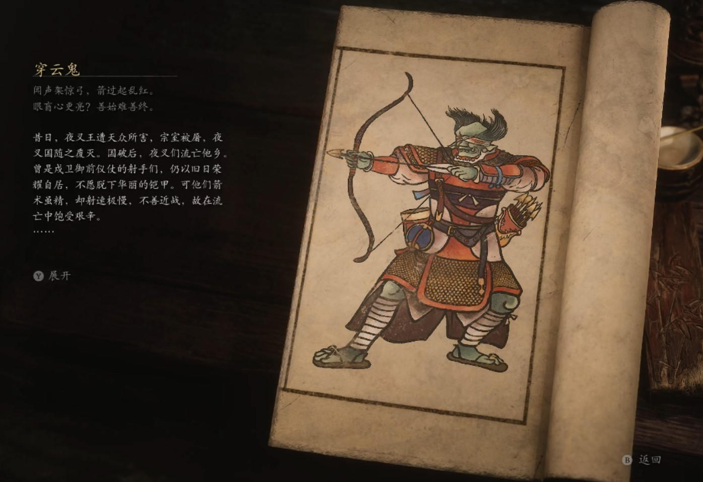

## 类型

小妖

## 描述

闻声架惊弓，箭过起乱红。

眼盲心更亮？善始难善终。

昔日，夜叉王遭天众所害，宗室被屠，夜叉国随之覆灭。国破后，夜叉们流亡他乡。曾是戍卫御前仪仗的射手们，仍以旧日荣耀自居，不愿脱下华丽的铠甲。可他们箭术虽精，却射速极慢，不善近战，故在流亡中饱受艰辛。

由于他们战力不济，只能暗处偷袭，住持便将其分配至浮屠界，让他们在那里好生修炼。他们日日遭受折磨，尤其当轮藏中响起妙音，众人为之癫狂时，戒刀僧更是绰着大刀专挑他们砍头。被逼无奈下，他们只好想法还击。

他们四处寻求指点，时常找戒刀僧挑战，结果屡战屡败。一日，监院的盲眼拳僧来浮屠界巡视。他们为修极乐大道，不惜自毁双目，但拳法着实精妙。夜叉射手向其请教，和尚答道：“你们太想命中，盯瞄太久，失了先机。不如学我，挖去双眼，便可凭心而射，箭无虚发也。”

射手们以全无办法，只好一试，遂自剜双目，还给自己换了响亮的名号。此后，戒刀僧果真很少再欺凌他们。有人问戒刀僧为何，戒刀僧答道：“谁想和疯子拼命？还是换个对手安全些。”

    