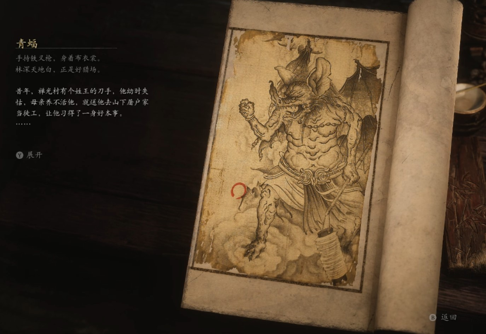

## 类型

小妖

## 描述

手持铁叉枪，身着布衣裳。

林深天地白，正是好猎场。

昔年，禅光村有个姓王的刀手，他幼时失怙，母亲养不活他，就送他去山下屠户家当徒工，让他习得了一身好本事。

这日，镇上有家富户做寿，请刀手去杀猪宰羊。因事情办得好，主人家多赏了他一条猪腿。刀手想把猪腿送给母亲享用，就连夜赶路回村。行至半路，见山道旁有人，手持一杆猎叉，着一袭旧布衫，招呼道：“阿哥，我是村里的猎户，在这坡下摽兔。夜里有些怕鬼，想与你同行。”

刀手点头答应，二人继续赶路。没多久，猎户主动搭话道：“不知阿哥听说否，近日山道上闹妖怪哩。”刀手笑道：“妖怪有什么好怕的？我腰上别着屠刀，肩上扛着猪腿。遇着妖怪，我就用猪腿抡他，用屠刀砍他。”猎户勉强笑笑。

又走一阵，猎户道：“阿哥既不怕妖怪，想必很有本事？”刀手笑道：“我自小宰杀畜生，一刀就能直中要害，一劈就能断骨断筋。”猎户生气道：“妖怪怎能和畜生并论？”刀手严肃道：“世上没有妖怪。替天行道的，都是豪杰;欺负良善的，都是猪狗。”猎户不知如何答话，只好默默往前走。

村子遥遥在望，猎户犹豫地道：“你既不害怕，何不转身看看我？”刀手早料到猎户是个妖怪，果真抢起猪腿就将其打倒在地，举刀就砍。那怪早已走了气势，急忙扇开翅膀飞到半空，啐道：“今日遇到个硬茬，晦气晦气！”骂完立刻逃走了。

咦，都说柿子要拣软的捏，做人还是刚强些好，硬气起来，妖怪都会怕你几分哩。

    