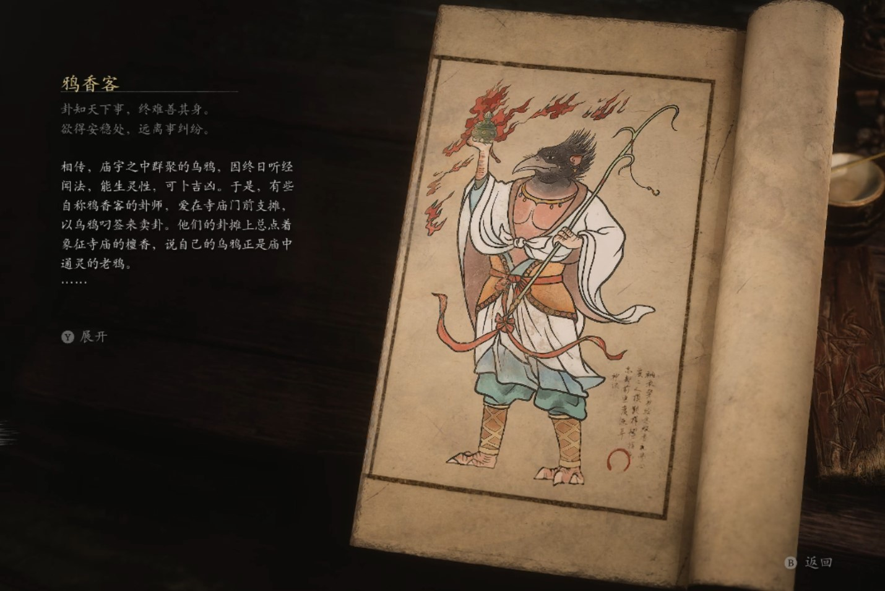

## 类型

小妖

## 描述

卦知天下事，终难善其身。

欲得安稳处，远离事纠纷。

相传，庙宇之中群聚的乌鸦，因终日听经闻法，能生灵性，可卜吉凶。于是，有些自称鸦香客的卦师，爱在寺庙门前支摊，以乌鸦叼签来卖卦。他们的卦摊上总点着象征寺庙的檀香，说自己的鸟鸦正是庙中通灵的老鸦。

有位鸦香客，他的乌鸦是自幼驯养的，能用特制的卦签与之交流。每日，他令乌鸦飞到城中各处窥看人们生活，待香客来求签时，便借助卦签向鸦群们打探消息。他将这些消息，混着自己对人事的了解真假参半，罗织预言，倒也颇能唬人。

一日，有位官员以重金求卦，鸦香客言他官运亨通，必能位极人臣。未料，官员当年非但未升，反降了一级。官员本怒不可遏，率家丁前来问罪。鸦香客又以乌鸦窥看的消息解释成官员，没花足够的钱修缮祠堂，糊弄而过。官员深信其能，竟将鸦香客引荐给了同僚们。

鸦香客凭此攒下了许多钱财，可他知悉了官员们太多秘辛，深恐自己性命难保，遂决定换个谋生之法。这日，他欲将乌鸦们悉数驱散，而乌鸦们却不肯离去。鸦香客便对乌鸦使尽各种手段，欲除之而后快。乌鸦们忍无可忍，奋起而攻之、将其啄食而亡。

其后，乌鸦们变化身形，穿上卖卦人的衣服，也称自己鸦香客，持着香炉，在庙宇四周继续叼签卖卦，装神弄鬼，哄骗世人。

    