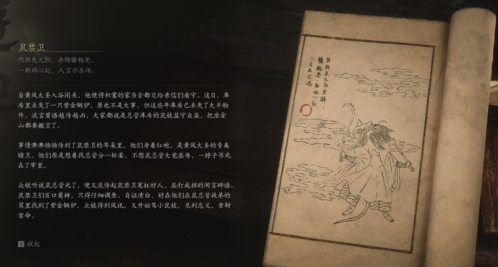

## 类型

小妖

## 描述

阴胜失元阳，赤锦镰钩亮。

一朝祸心起，人言亦杀场。

自黄风大圣入谷闭关，他便将积蓄的家当全都交给亲信们看守。这日，库房里丢失了一只紫金铜炉，原也不是大事，但这些年库房已丢失了大半物件，流言蜚语越传越凶，大家都说是总管库房的鼠妖监守自盗，把座金山都要搬空了。

事情沸沸扬扬传到了鼠禁卫的耳朵里，他们身着红袍，是黄风大圣的专属暗卫。他们原是想着找总管分一杯羹，不想鼠总管大觉屈辱，一脖子吊死在了牢里。

众妖听说鼠总管死了，便又流传起鼠禁卫冤枉好人，屈打成招的闲言碎语。鼠禁卫们百口莫辩，只得仔细调查，自证清白，好在他们在鼠总管徒弟的窝里找到了紫金铜炉，众妖得到风讯，又开始骂小鼠妖，见利忘义，贪财害命。

    